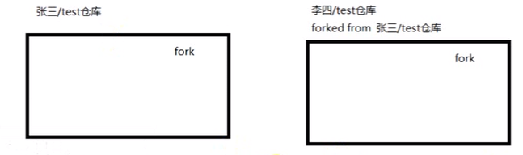
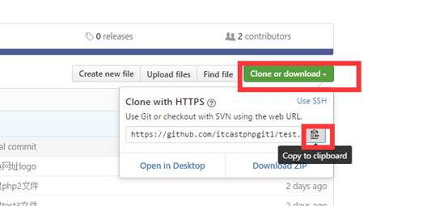

# 使用Git

## 目的

借助github托管项目代码

## 基本概念

### 仓库（Repository）

仓库的意思，即你的项目，你想在GitHub上开源一个项目，那就必须新建一个Repository，如果开源的项目多了，就拥有了多个Repository

### 收藏（Star）

收藏项目，方便下次查看。

### 复制克隆项目（Fork）



该fork的项目是独立存在的。

### 发起请求（Pull Request）

发起请求，这个其实是基于Fork的。如果别人在你项目的基础上做了改进，后来觉得改进的不错，应该要把这些改进让更多人获益，于是就想把自己的改进合并到原有的项目里，这个时候他就可以发起一个pull Request（PR）,原有项目创建人，也就是你，就可以收到这个请求，这个时候你会仔细review他的代码，并且测试觉得OK了，就会接受他的PR，这个时候他做的改进原有项目就有了。

### 关注（Watch）

关注项目，当项目更新可以接收到通知

### 事务卡片（Issues）

发现代码BUG，但是目前没有成型代码，需要讨论时用；

当你开源了一个项目，别人发现你的项目中有bug，或者哪些地方做的不够好，他就可以给你提issue，即问题，你看到了这些问题就可以逐个修复，修复ok了就可以一个个close掉了。

## 初次使用git前的配置

~~~
> git config --global user.name "FishC_Service"
> git config --global user.email "fishc_service@126.com"
~~~

**普通的程序员是把很多的时间放在写代码和调 Bug 上，而优秀的程序员是将更多的精力放在设计上……**

## 三棵树

  你的本地仓库有 Git 维护的三棵“树”组成，这是 Git 的核心框架。

这三棵树分别是：工作区域、暂存区域和 Git 仓库  


工作区域（Working Directory）就是你平时存放项目代码的地方。

暂存区域（Stage）用于临时存放你的改动，事实上它只是一个文件，保存即将提交的文件列表信息。

Git 仓库（Repository）就是安全存放数据的位置，这里边有你提交的所有版本的数据。其中，HEAD 指向最新放入仓库的版本（这第三棵树，确切的说，应该是 Git 仓库中 HEAD 指向的版本）。

Git 的工作流程：  

1. 在工作目录中添加、修改文件；

2. 将需要进行版本管理的文件放入暂存区域；

3. 将暂存区域的文件提交到 Git 仓库。

因此，Git 管理的文件有三种状态：已修改（modified）、已暂存（staged）和已提交（committed），依次对应上边的每一个流程。

你说 Git 仓库用于存放每次的版本迭代，我可以理解。但为何还要多增加一个暂存区域呢？”

我这里打个比方：像某些厂家开发一个产品，一般他们都留有一手，不会把该产品的所有特性一次性发布。通过产品的迭代，每年秋季你就可以开开心心地买到又有一两项新功能的“新”产品了。

So，有时你并不想把工作目录中所有的新功能都提交到最新版本，你就可以先添加一些本次需要提交的文件到暂存区，然后从暂存区中提交它们……所以暂存区在江湖中有个外号叫“索引”（Index）。

## 使用命令

### 创建文件夹

~~~git
mkdir test
~~~

### 在文件夹内创建仓库

```
cd test
pwd
git init
```

### 向仓库添加文件

~~~
touch a1.php                         # 创建a1.php文件到工作目录
~~~

### 将文件添加到暂存区

~~~
git add a1.php                      # 添加a1.php到暂存区
~~~

### 将文件从暂存区提交到本地仓库

~~~
git commit -m  '第一次提交文件'     # 添加a1.php到仓库
~~~

### 修改仓库文件

~~~
vi a1.php
~~~

### 查看修改内容

~~~
git diff readme.txt
~~~

### 删除仓库文件

~~~
rm -rf a1.php
~~~

### 克隆远程仓库

~~~
git clone https://github.com
~~~



### 添加远程仓库

~~~
$ git remote add origin git@github.com:用户名/learngit.git
~~~

### 将本地库的内容推送到远程库

~~~
$ git push -u origin master # 第一次加-u
~~~

~~~
$ git push origin master
~~~

### 显示当前目录

~~~
pwd
~~~

### 查看当前状态

~~~
git status
~~~

