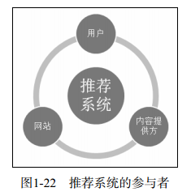
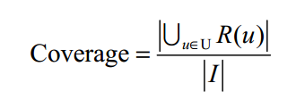
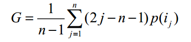

## 1.推荐系统概述

推荐系统的任务是就是联系用户和信息，一方面帮助用户发现对自己有价值的信息，另一方面让信息能够展现在对它感兴趣的用户面前，从而实现信息消费者和信息生产者的双赢。

和搜索引擎一样，推荐系统也是一种帮助用户快速发现有用信息的工具。和搜索引擎不同的是，推荐系统不需要用户提供明确的需求，而是通过分析用户的历史行为给用户的兴趣建模，从而主动给用户推荐能够满足他们兴趣和需求的信息。

从物品的角度出发，推荐系统可以更好地发掘物品的长尾。主流商品往往代表了绝大多数用户的需求，而长尾商品往往代表了一小部分用户的个性化需求。因此，如果通过发掘长尾提高销售额，就必须充分研究用户的兴趣，而这正是个性化推荐系统主要解决的问题。推荐系统通过发掘用户的行为，找到用户的个性化需求，从而将长尾商品准确地推荐给需要它的用户，帮助用户发现那些他们感兴但很难发现的商品。

==几乎所有的推荐系统应用都是由前台的展示页面、后台的日志系统以及推荐算法系统3部分构成的==

个性化推荐的成功应用需要两个条件。

1. 存在信息过载。因为如果用户可以容易地从所有物品中找到喜欢的物品，就不需要个性化推荐了。

2. 用户大部分时候没有明确的需求。因为用户如果有明确的需求，可以直接通过搜索引擎找到感兴趣的物品。

## 2.推荐系统评测

什么才是好的推荐系统？这是推荐系统评测需要解决的问题。

一个完整的推荐系统一般存在3个参与方：用户、物品提供者和提供推荐商品的网站。以图书推荐为例，首先，推荐系统需要满足用户的需求，给用户推荐那些令他们感兴趣的图书。其次，推荐系统要让各出版社的书都能够被推荐给对其感兴趣的用户，而不是只推荐几个大型出版社的书。最后，好的推荐系统设计，能够让推荐系统本身收集到高质量的用户反馈，不断完善推荐的质量，增加用户和网站的交互，提高网站的收入。

因此在评测一个推荐算法时，需要同时考虑三方的利益，一个好的推荐系统是能够令三方共赢的系统。

好的推荐系统不仅仅能够准确预测用户的行为，而且能够扩展用户的视野，帮助用户发现那些它们可能感兴趣，但不那么容易发现的东西。同时，推荐系统还能够帮助商家将那些被埋没在长尾中的好商品介绍给可能会对它们感兴趣的用户。

==评测指标包括：准确度、覆盖率、新颖度、惊喜度、信任度、透明度等。==

### 2.1 实验方法

在推荐系统中，主要有3中评测推荐效果的实验方法：离线实验（offline experiment）、用户调查（user study）、在线实验（online experiment）。

#### 离线实验

离线实验的方法一般如下几个步骤构成：

（1）通过日志系统获得用户行为数据，并按照一定的格式生成一个标准的数据集；

（2）将数据集按照一定的规则分成训练集和测试集；

（3）在训练集上训练用户兴趣模型，在测试集上进行预测；

（4）通过事先定义的离线指标评测算法在测试集上的预测结果；

从上面的步骤可以看到，推荐系统的离线实验都是在数据集上完成的，也就是说它不需要一个实际的系统来供它实验。

（商业上关注的指标，如点击率，转化率等）

（预测准确率和用户满意度之间存在差别）

#### 用户调查

用户调查是推荐系统评测的一个重要工具，很多离线时没有办法评测的与用户主观感受有关的指标都可以通过用户调查获得。

==双盲实验==

#### 在线实验

AB测试是一种很常用的在线评测算法的实验方法。它通过一定的规则将用户随机分成几组，并对不同组的用户采用不同的算法，然后通过统计不同组用户的各种不同的评测指标比较不同的算法，比如可以统计不同组用户的点击率，通过点击率比较不同算法的性能。

AB测试的优点是可以公平获得不同算法实际在线的性能指标，包括商业上关注的指标。

AB测试的缺点主要是周期比较长，必须进行长期的实验才能得到可靠地结果。

一般来说，一个新的推荐算法最终上线，需要完成上面所说的3个实验。

- 首先，需要通过离线实验证明它在很多离线指标上优于现有的算法。

- 然后，需要通过用户调查确定它的用户满意度不低于现有的算法。
- 最后，通过在线的AB测试确定它在我们关心的指标上优于现有的算法。

### 2.2评测指标

#### 用户满意度

用户作为推荐系统的重要参与者，其满意度是评测推荐系统的最重要指标。但是，用户满意度没有办法离线计算，只能通过用户调查或在线试验获得。

用户调查获得用户满意度主要通过调查问卷的形式。

#### 预测准确度（重点）

预测准确度度量是一个推荐系统或者推荐算法预测用户行为的能力。这个指标是最重要的推荐系统离线评测指标。==在计算该指标时需要有一个离线的数据集，该数据集包含用户的历史行为记录。然后，将该数据集通过时间分成训练集和测试集。最后，通过在训练集上建立用户行为和兴趣模型预测用户在测试集上的行为，并计算预测行为和测试集上实际行为的重合度作为预测准确度。==

- 评分预测

预测用户对物品评分的行为称为评分预测。

评分预测的预测准确度一般通过==均方根误差（RMSE）==和==平均绝对误差（MAE）==计算。

对于测试集中的一个用户u和物品i，令rui是用户u对物品i的实际评分，r^ui是推荐算法给出的预测评分，那么RMSE的定义为：

(RMSE加大了对预测不准的用户物品评分的惩罚，即平方项惩罚)

MAE采用绝对值计算预测误差，它的定义为：

（如果评分系统是基于整数建立的，即用户给的评分都是整数，那么对预测结果取整会降低MAE的误差）

- TopN推荐

网站在提供推荐服务时，一般是给用户一个个性化的推荐列表，这种推荐叫做TopN推荐。

TopN推荐的预测准确率一般通过准确率（precision）/召回率（recall）度量。

令R(u)是根据用户在训练集上的行为给用户作出的推荐列表，而T(u)是用户在测试集上的行为列表。那么，推荐结果的召回率定义为：

推荐结果的准确率定义为：

下面的python代码同时计算出了一个推荐算法的准确率和召回率：

#### 覆盖率

覆盖率（coverage）描述一个推荐系统对物品长尾的发掘能力。覆盖率有不同的定义方法，最简单的定义为推荐系统能够推荐出来的物品占总物品集合的比例。

假设系统的用户集合为U，推荐系统给每个用户推荐一个长度为N的物品列表R(u)。那么推荐系统的覆盖率可以通过下面的公式计算：

从上面的定义可以看到，覆盖率是一个内容提供商会关心的指标。覆盖率为100%的推荐系统可以将每个物品都推荐给至少一个用户。覆盖率为100%的系统可以有无数的物品流行度分布。

为了更细致地描述推荐系统发掘长尾的能力，需要统计推荐列表中不同物品出现次数的分布。如果所有的物品都出现在推荐列表中，且出现的次数差不多，那么推荐系统挖掘长尾的能力就很好。因此，可以通过研究物品在推荐列表中出现的次数的分布描述推荐系统挖掘长尾的能力。如果这个分布比较平，那么说明推荐系统的覆盖率较高，而如果这个分布较陡峭，说明推荐系统的覆盖率较低。

在信息论和经济学中有两个著名的指标可以用来定义覆盖率。

==第一个是信息熵：==

这里p(i)是物品i的流行度除以所有物品流行度之和。

==第二个指标是基尼系数（Gini Index）：==（评测推荐系统是否具有马太效应，即强者更强，弱者更弱）

这里，i~j~是按照物品流行度p()从小到大排序的物品列表中第j个物品。

#### 多样性

推荐列表需要能够覆盖用户不同的兴趣领域，即推荐结果需要具有多样性。

==多样性描述了推荐列表中物品两两之间的不相似性。==因此，多样性和相似性是相对应的。假设s(i,j)$\in$[0,1]定义了物品i和j之间的相似度，那么用户u的推荐列表R(u)的多样性定义如下：

而推荐系统的整体多样性可以定义为所有用户推荐列表多样性的平均值：

从上面的定义可以看到，不同的物品相似度度量函数s(i,j)可以定义不同的多样性。如果用内容相似度描述物品间的相似度，我们就可以得到内容多样性函数，如果用协同过滤的相似度函数描述物品间的相似度，就可以得到协同过滤的多样性函数。

#### 新颖度

新颖的推荐是指给用户推荐那些他们以前没有听说过的物品。

评测新颖度的最简单的方法是利用推荐结果的平均流行度，因为越不热门的物品越可能让用户觉得新颖。因此，如果推荐系统中物品的平均热门程度较低，那么推荐结果就可能有比较高的新颖度。

#### 惊喜度

如果推荐结果和用户的历史兴趣不相似，但却让用户觉得满意，那么就可以说推荐结果的惊喜度很高，而推荐的新颖度仅仅取决于用户是否听说过这个推荐结果。

==提高推荐惊喜度需要提高推荐结果的用户满意度，同时降低推荐结果和用户历史兴趣的相似度。==

#### 信任度

提高推荐系统的信任度主要有两个方法。

首先需要增强推荐系统的透明度（transparency），而增加推荐系统透明度的主要办法是提供推荐解释。只有让用户了解推荐系统的运行机制，让用户认同推荐系统的运行机制，才会提高用户对推荐系统的信任度。

其次是考虑用户的社交网络信息，利用用户的好友信息给用户做推荐，并且用好友进行推荐解释。

#### 实时性

推荐系统的实时性包括以下两个方面：

1. 推荐系统需要实时的更新推荐列表来满足用户新的行为变化。
2. 推荐系统需要能够将新加入系统的物品推荐给用户。这主要考验了推荐系统处理物品冷启动的能力。

#### 健壮性

健壮性（robust，鲁棒性）指衡量了一个推荐系统抗击作弊的能力。

### 2.3 总结

