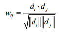

## 1. 冷启动问题简介

在没有大量用户数据的情况下设计个性化推荐系统并且让用户对推荐结果满意从而愿意使用推荐系统，就是冷启动的问题。 

冷启动问题（cold start）只要分3类：

- 用户冷启动 ：用户冷启动主要解决如何给新用户做个性化推荐的问题。当新用户到来时，我们没有他的行为数据，所以也无法根据他的历史行为预测其兴趣，从而无法借此给他做个性化推荐 。
- 物品冷启动 ：物品冷启动主要解决如何将新的物品推荐给可能对它感兴趣的用户这一问题。 
- 系统冷启动 ：系统冷启动主要解决如何在一个新开发的网站上（还没有用户，也没有用户行为，只有一些物品的信息）设计个性化推荐系统，从而在网站刚发布时就让用户体验到个性化推荐服务这一问题。 

## 2. 解决方法

### 2.1 利用用户注册信息 

在网站中，当新用户刚注册时，我们不知道他喜欢什么物品，于是只能给他推荐一些热门的商品。但如果我们知道她是一位女性，那么可以给她推荐女性都喜欢的热门商品。 

用户的注册信息分3种:

1. 人口统计学信息：包括用户的年龄、性别、职业、民族、学历和居住地。
2. 用户兴趣的描述：有一些网站会让用户用文字描述他们的兴趣。
3. 从其他网站导入的用户站外行为数据 ：比如用户通过豆瓣、新浪微博的账号登录，就可以在得到用户同意的情况下获取用户在豆瓣或者新浪微博的一些行为数据和社交网络数据。 

基于注册信息的个性化推荐流程基本如下：

1. 获取用户的注册信息；
2.  根据用户的注册信息对用户分类；
3.  给用户推荐他所属分类中用户喜欢的物品。 

由图3-3中的例子可知，基于用户注册信息的推荐算法**其核心问题是计算每种特征的用户喜欢的物品**。也就是说，对于每种特征f，计算具有这种特征的用户对各个物品的喜好程度$p(f,i)$。 

$p(f,i)$可以简单地定义为物品i在具有f的特征的用户中的热门程度： 

其中 N(i)是喜欢物品i的用户集合， U(f)是具有特征f的用户集合。 

在这种定义下，往往热门的物品会在各种特征的用户中都具有比较高的权重。也就是说具有比较高的 N(i)的物品会在每一类用户中都有比较高的 $p(f,i)$ 。给用户推荐热门物品并不是推荐系统的主要任务，推荐系统应该帮助用户发现他们不容易发现的物品。因此，我们可以将 $p(f,i)$ 定义为喜欢物品i的用户中具有特征f的比例：  

这里分母中使用参数$\alpha$的目的是解决数据稀疏问题。 

### 2.2 选择合适的物品启动用户的兴趣

解决用户冷启动问题的另一个方法是在新用户第一次访问推荐系统时，不立即给用户展示推荐结果，而是给用户提供一些物品，让用户反馈他们对这些物品的兴趣，然后根据用户反馈给提供个性化推荐。 

对于这些通过让用户对物品进行评分来收集用户兴趣，从而对用户进行冷启动的系统，它们需要解决的首要问题就是如何选择物品让用户进行反馈。
一般来说，能够用来启动用户兴趣的物品需要具有以下特点。 

- 比较热门 
- 具有代表性和区分度
- 启动物品集合需要有多样性

上面这些因素都是选择启动物品时需要考虑的，但如何设计一个选择启动物品集合的系统呢？

用一个决策树解决这个问题 ：

给定一群用户，用这群用户对物品评分的方差度量这群用户兴趣的一致程度。如果方差很大，说明这一群用户的兴趣不太一致，反之则说明这群用户的兴趣比较一致。 令$\sigma$~u~$\in$U'为用户U'中所有评分的方差，基本思想是通过如下方式度量一个物品的区分度D(i): 

其中，N^+^(i)是喜欢物品i的用户集合， N^-^(i)是不喜欢物品i的用户集合，最后一个N(i)是没有对物品i评分的用户集合。等式中第一项是喜欢物品i的用户对其他物品评分的方差， 第二项是不喜欢物品i的用户对其他物品评分的方差，第三项是没有对物品i评分的用户对其他物品评分的方差。 也就是说，对于物品i，将用户分成3类——喜欢物品i的用户、不喜欢物品i的用户和不知道物品i的用户（即没有给i评分的用户）。如果这3类用户集合内的用户对其他的物品兴趣很不一致，说明物品i具有较高的区分度。 

例子：

假设通过分析用户数据，我们发现《变形金刚》最有区分度。而在喜欢《变形金刚》的用户中《钢铁侠》最有区分度，不知道《变形金刚》的用户中《阿甘正传》最有区分度，不喜欢《变形金刚》的用户中《泰坦尼克号》最有区分度。进一步分析，我们发现不喜欢《变形金刚》但喜欢《泰坦尼克号》的用户中，《人鬼情未了》最有区分度。那么，假设来了一个新用户，系统会首先询问他对《变形金刚》的看法，如果他说不喜欢，我们就会问他对《泰坦尼克》号的看法，如果他说喜欢，我们就会问他对《人鬼情未了》的看法，如果这个时候用户停止了反馈，我们也大概能知道该用户可能对爱情片比较感兴趣，对科幻片兴趣不大。 

### 2.3 利用物品的内容信息

物品冷启动需要解决的问题是如何将新加入的物品推荐给对它感兴趣的用户。可以考虑利用物品的内容信息，将新物品先投放给曾经喜欢过和它内容相似的其他物品的用户。 

物品的内容可以通过向量空间模型表示，该模型会将物品表示成一个关键词向量。如果物品的内容是一些诸如导演、演员等实体的话，可以直接将这些实体作为关键词。 但如果内容是文本的形式，则需要引入一些理解自然语言的技术抽取关键词。 

对物品d，它的内容表示成一个关键词向量如下： 

其中， e~i~就是关键词， w~i~是关键词对应的权重。如果物品是文本，我们可以用信息检索领域著名的TF-IDF公式计算词的权重： 

 词频（TF）: 表示词条（关键字）在文本中出现的频率。IDF：可以由总文件数目除以包含该词语的文件的数目**，**再将得到的商取对数得到。

在给定物品内容的关键词向量后，物品的内容相似度可以通过向量之间的余弦相似度计算： 

内容过滤算法忽视了用户行为，从而也忽视了物品的流行度以及用户行为中所包含的规律，所以它的精度比较低，但结果的新颖度却比较高。但是如果用户的行为强烈受某一内容属性的影响，那么内容过滤的算法还是可以在精度上超过协同过滤算法的。不过这种强的内容特征不是所有物品都具有的，而且需要丰富的领域知识才能获得，所以很多时候内容过滤算法的精度比协同过滤算法差。 

