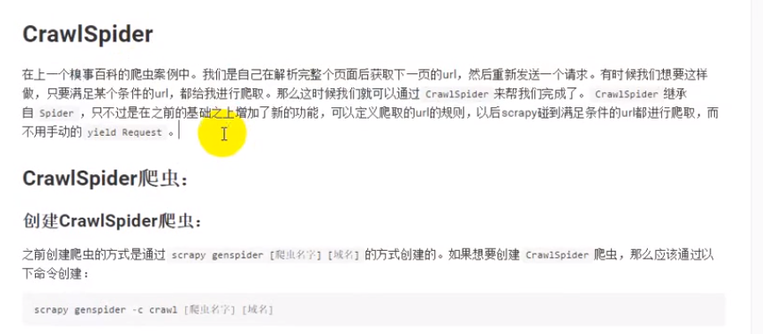
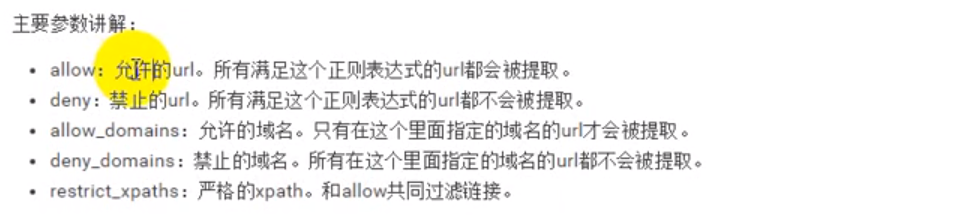
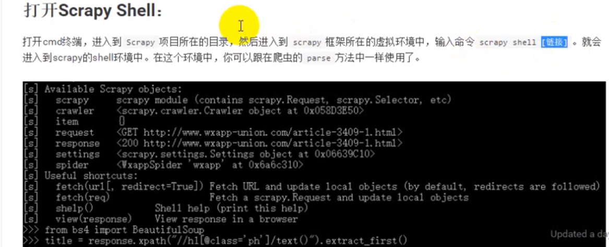
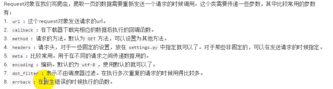
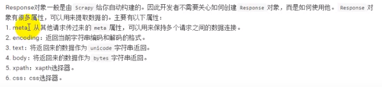
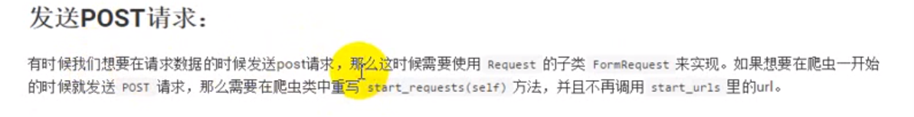

# Scrapy入门

笔记：

## 创建项目和爬虫

1. 创建项目：`scrapy startproject [爬虫的名字]`。
2. 创建爬虫：进入到项目所在的路径，执行命令：`scrapy genspider [爬虫名字] [爬虫的域名]。`注意，爬虫名字不能和项目名称一致

## 项目目录结构

见上

# CrawlSipder

==**这里是-t**==

allow 和 deny用的比较多。

# Scrapy Shell

# Request对象

# Response对象

