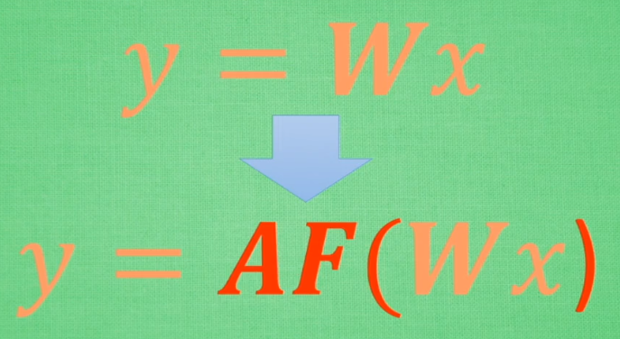
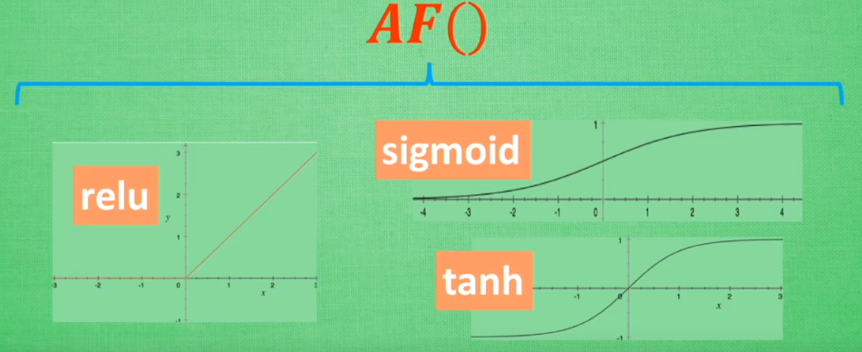
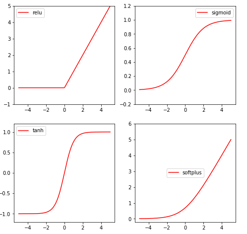

## 0 从例子入门

第一个例子：

~~~python
import tensorflow as tf
import numpy as np

# create real data 因为在TensorFlow中大部分数据都是float32的形式，所以定制为32
x_data = np.random.rand(100).astype(np.float32)
y_data = x_data*0.1 + 0.3

### create tensorflow structure start ###

# 定义变量
Weights = tf.Variable(tf.random_uniform([1],-1.0,1.0)) # # 数列随机均匀分布生成
biases = tf.Variable(tf.zeros([1]))

# 如何计算预测值
y = Weights * x_data + biases

# loss function
loss = tf.reduce_mean(tf.square(y-y_data))

# 梯度下降优化器，定义learning rate,一般小于1
optimizer = tf.train.GradientDescentOptimizer(0.5)

# 训练目标为loss最小化
train = optimizer.minimize(loss)

# 初始化变量，即初始化Weights 和 biases
init = tf.global_variables_initializer()

# 创建session，进行参数初始化
sess = tf.Session()
sess.run(init)  # 激活

# 开始训练200步，每隔20步输出一下两个参数
for step in range(201):
    sess.run(train)
    if step % 20 ==0:
        print(step,sess.run(Weights),sess.run(biases))
### create tensorflow structure start ###
~~~

上面的例子实现的是给定训练样本和真实值，通过梯度下降法来训练得到参数W和b，从而得到预测的方程式：

y = 0.1 * x + 0.3。

首先，给定训练样本和真实值（这里使用numpy生成训练样本，并事先计算真实值）：

~~~python
# create real data 因为在TensorFlow中大部分数据都是float32的形式，所以定制为32
x_data = np.random.rand(100).astype(np.float32)
y_data = x_data*0.1 + 0.3
~~~

然后使用tf.Variable定义参数变量Weights和biases（w和b）：

Weights通过一个数列随机均匀分布生成(tf.random_uniform)，结构为1维（就是一个数），范围为（-1.0，1.0）

而bias则设置为0，同样为1维结构。

~~~python
# 定义变量
Weights = tf.Variable(tf.random_uniform([1],-1.0,1.0))
biases = tf.Variable(tf.zeros([1]))
~~~

下面定义如何计算预测值，建立损失函数，以及使用梯度下降算法进行优化，学习率取0.5，训练目标为最小化损失函数。

~~~python
# 如何计算预测值
y = Weights * x_data + biases

# loss function
loss = tf.reduce_mean(tf.square(y-y_data))

# 梯度下降优化器，定义learning rate,一般小于1
optimizer = tf.train.GradientDescentOptimizer(0.5)

# 训练目标为loss最小化
train = optimizer.minimize(loss)
~~~

在tf中定义需要初始化的变量。

~~~python
# 初始化变量，即初始化Weights 和 biases
init = tf.global_variables_initializer()# 创建session，进行参数初始化
~~~

接下来开始进行训练，训练需要创建一个session，通过run方法对指定的节点进行训练，**一定要注意需要激活初始化参数**，否则后面无法进行训练。想要观察训练过程中的参数变化的话，也需要通过run方法：

~~~python
# 创建session，进行参数初始化
sess = tf.Session()
sess.run(init)  # 激活参数（非常重要）

# 开始训练200步，每隔20步输出一下两个参数
for step in range(201):
    sess.run(train)
    if step % 20 ==0:
        # 观察参数w和b的变化
        print(step,sess.run(Weights),sess.run(biases))
### create tensorflow structure start ###
~~~

## 1 Session会话控制

Session 是 Tensorflow 为了控制,和输出文件的执行的语句. 运行 session.run() 可以获得你要得知的运算结果, 或者是你所要运算的部分，有两种使用Session的方式，我们可以从下面的例子中看出来,但在实际中，我们更推荐后者：

~~~python
import tensorflow as tf

# constant常量，[[3,3]]:一行两列的矩阵
matrix1 = tf.constant([[3,3]])
# [[2],[2]]两行一列
matrix2 = tf.constant([[2],
                       [2]])

# matmul矩阵乘法：matrix multply
product = tf.matmul(matrix1,matrix2) # numpy中为np.dot(m1,m2)

# 第一种方式
sess = tf.Session()
result = sess.run(product)
print(result)
sess.close()

# 第二种例子
with tf.Session() as sess: # 打开Session以sess命名，不用去管用不用关上它，运行在with之内的语句
    result2 = sess.run(product)
    print(result2)
~~~

## 2 Variable变量

在 Tensorflow 中，定义了某字符串是变量，它才是变量，这一点是与 Python 所不同的。定义语法： 

==state = tf.Variable()==

如果你在 Tensorflow 中设定了变量，那么初始化变量是最重要的！！所以定义变量以后, 一定要定义：

==init =  tf.global_variables_initializer()==

到这里变量还是没有被激活，需要再在 sess 里， 

==sess.run(init)== , 激活 init 这一步.

~~~python
import tensorflow as tf

# 定义变量，给定初始值0和name="counter"
state = tf.Variable(0,name="counter")
# counter:0
print(state.name)

# 定义常量1
one = tf.constant(1)

new_value = tf.add(state,one)
# 将new_value加载到state中
update = tf.assign(state,new_value)

#这里只是定义，必须用session.run来执行
init = tf.global_variables_initializer()

with tf.Session() as sess:
    sess.run(init)
    for _ in range(3):
        sess.run(update) # 加载update的时候会自动执行里面的new_value
        print(sess.run(state))
~~~

## 3 placeholder传参

placeholder 是 Tensorflow 中的占位符，暂时储存变量.

~~~python
tf.placeholder(
    dtype,
    shape=None,
    name=None
)
~~~

参数：

1. dtype：数据类型。常用的是tf.float32,tf.float64等数值类型
2. shape：数据形状。默认是None，就是一维值，也可以是多维（比如[2,3], [None, 3]表示列是3，行不定）
3. name：名称

Tensorflow 如果想要从外部传入data, 那就需要用到 tf.placeholder(), 然后以这种形式传输数据

 sess.run(***, feed_dict={input: \*\*}).

~~~python
import tensorflow as tf

# 大部分情况只能处理float32
x1 = tf.placeholder(dtype=tf.float32, shape=None)
y1 = tf.placeholder(dtype=tf.float32, shape=None)
z1 = x1 + y1

x2 = tf.placeholder(dtype=tf.float32, shape=[2, 1])
y2 = tf.placeholder(dtype=tf.float32, shape=[1, 2])
z2 = tf.matmul(x2, y2)

with tf.Session() as sess:
    # when only one operation to run
    z1_value = sess.run(z1, feed_dict={x1: 1, y1: 2})

    # when run multiple operations
    z1_value, z2_value = sess.run(
        [z1, z2],       # run them together
        feed_dict={
            x1: 1, y1: 2,
            x2: [[2], [2]], y2: [[3, 3]]
        })
    print(z1_value) # 3.0
    print(z2_value) 
    # [[6. 6.]
    #  [6. 6.]]
~~~

## 4 激励函数（matplotlib基础）

用来解决不能用线性方程所概括的问题。






```python
import tensorflow as tf
import numpy as np
import matplotlib.pyplot as plt

# fake data
x = np.linspace(-5, 5, 200)     # x data, shape=(100, 1)

# following are popular activation functions
y_relu = tf.nn.relu(x)
y_sigmoid = tf.nn.sigmoid(x)
y_tanh = tf.nn.tanh(x)
y_softplus = tf.nn.softplus(x)
# y_softmax = tf.nn.softmax(x)  softmax is a special kind of activation function, it is about probability

sess = tf.Session()
y_relu, y_sigmoid, y_tanh, y_softplus = sess.run([y_relu, y_sigmoid, y_tanh, y_softplus])

# plt to visualize these activation function
plt.figure(1, figsize=(8, 6)) # 自定义画布大小
plt.subplot(221) # 在2x2画布中第1块区域输出图形
plt.plot(x, y_relu, c='red', label='relu')
plt.ylim((-1, 5))  # 设置y轴刻度的范围 -1-5
plt.legend(loc='best')

plt.subplot(222)
plt.plot(x, y_sigmoid, c='red', label='sigmoid')
plt.ylim((-0.2, 1.2)) # 设置y轴刻度的范围 -0.2-1.2
plt.legend(loc='best')

plt.subplot(223)
plt.plot(x, y_tanh, c='red', label='tanh')
plt.ylim((-1.2, 1.2))
plt.legend(loc='best')

plt.subplot(224)
plt.plot(x, y_softplus, c='red', label='softplus')
plt.ylim((-0.2, 6))
plt.legend(loc='center') # 图例的位置

plt.show()
```




