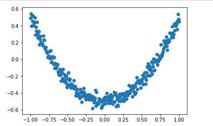
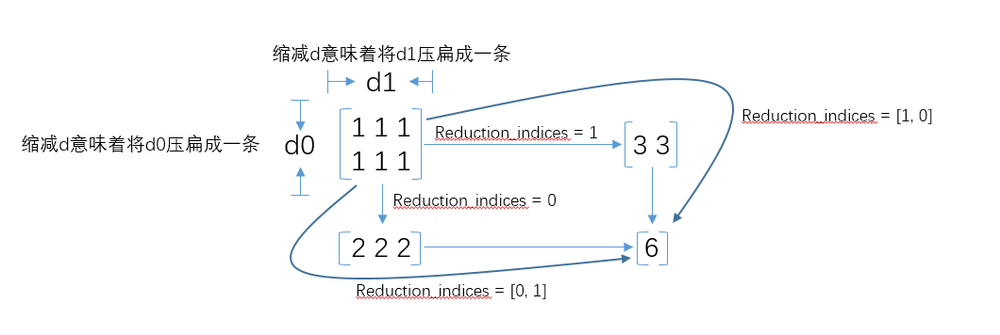

现在使用TensorFlow实现一个简单的神经网络，用神经网络来预测 y = x^2^ - 0.5,
输入层和输出层都只有一个神经元，而隐藏层有10个神经元。

## 1 定义加入神经层

首先我们使用一个函数来定义网络的一层，输入的参数是该层输入，输入数据的大小，输出数据的大小，以及使用的激活函数，激活函数在默认情况下是None，即不适用激活函数。

~~~python
def add_layer(input,in_size,out_size,activation_function=None):
    Weights = tf.Variable(tf.random_normal([in_size,out_size])) # random_normal 用于从服从指定正态分布的数值中取出随机数
    biases = tf.Variable(tf.zeros[1,out_size]) + 0.1)
    Wx_plus_b = tf.matmul(inputs,Weights) + biases
    if activation_function is None:
        outputs = Wx_plus_b
    else:
        outputs = activation_function(Wx_plus_b)
    return outputs
~~~

## 2 生成训练数据

这里，我们生成300*1的x，然后增加一点噪声noise，通过y = x^2 - 0.5+noise来生成y 。

~~~python
# Make up some real data # np.newaxis：增加一个维度
x_data = np.linspace(-1, 1, 300, dtype=np.float32)[:, np.newaxis] # (-1,1),300个单位
noise = np.random.normal(0, 0.05, x_data.shape).astype(np.float32) # 方差为0.05
y_data = np.square(x_data) - 0.5 + noise

##plt.scatter(x_data, y_data) # 绘制散点图
##plt.show()
~~~




注：

```python
a = np.linspace(1,10,5,endpoint= True)
print(a) # [1. 3.25 5.5 7.75 10.]

x = np.array([1,2,3])
print(x.shape) # (3,)
x = np.array([1,2,3])[:,np.newaxis]
print(x)
##[[1]
## [2]
## [3]]
print(x.shape) # (3,1)
```

## 3 构建网络

这里，定义输入层-隐藏层-输出层的三层神经网络结构，其中输入层和输出层仅有一个神经元，而隐藏层有10个神经元。同时，我们定义我们的损失是平方损失函数，通过梯度下降法来最小化我们的损失。

~~~python
# define placeholder for inputs to network
xs = tf.placeholder(tf.float32, [None, 1])
ys = tf.placeholder(tf.float32, [None, 1])
# add hidden layer
l1 = add_layer(xs, 1, 10, activation_function=tf.nn.relu)
# add output layer
prediction = add_layer(l1, 10, 1, activation_function=None)

# the error between prediction and real data
loss = tf.reduce_mean(tf.reduce_sum(tf.square(ys-prediction), reduction_indices=[1]))
train_step = tf.train.GradientDescentOptimizer(0.1).minimize(loss)
~~~

对每个样本点的平方损失使用tf.reduce_sum进行求和，reduction_indices=[1]，直译过来就是指“坍塌维度”，即按照哪个维度进行加法运算。比如：square(y-x)=[1,4,9,16]，是个一维向量（张量），所以reduction_indices只能设为0，设其他会报错。运算结果是30，也就是1维坍塌为0维。



## 4 定义Session并进行训练

~~~python
# important step
sess = tf.Session()

init = tf.global_variables_initializer()
sess.run(init)

for i in range(1000):
    # training
    sess.run(train_step, feed_dict={xs: x_data, ys: y_data})
    if i % 50 == 0:
        # to see the step improvement
        print(sess.run(loss, feed_dict={xs: x_data, ys: y_data}))
~~~

完整代码

~~~python
import tensorflow as tf
import numpy as np
import matplotlib.pyplot as plt

def add_layer(inputs, in_size, out_size, activation_function=None):
    Weights = tf.Variable(tf.random_normal([in_size, out_size]))
    biases = tf.Variable(tf.zeros([1, out_size]) + 0.1)
    Wx_plus_b = tf.matmul(inputs, Weights) + biases
    if activation_function is None:
        outputs = Wx_plus_b
    else:
        outputs = activation_function(Wx_plus_b)
    return outputs

# Make up some real data
x_data = np.linspace(-1, 1, 300, dtype=np.float32)[:, np.newaxis] # (-1,1),300个单位
noise = np.random.normal(0, 0.05, x_data.shape).astype(np.float32)
y_data = np.square(x_data) - 0.5 + noise

# print(x_data)
# plt.scatter(x_data, y_data) # 绘制散点图
# plt.show()

# define placeholder for inputs to network
xs = tf.placeholder(tf.float32, [None, 1])
ys = tf.placeholder(tf.float32, [None, 1])
# add hidden layer
l1 = add_layer(xs, 1, 10, activation_function=tf.nn.relu)
# add output layer
prediction = add_layer(l1, 10, 1, activation_function=None)

# the error between prediction and real data
loss = tf.reduce_mean(tf.reduce_sum(tf.square(ys-prediction), reduction_indices=[1]))
train_step = tf.train.GradientDescentOptimizer(0.1).minimize(loss)
# important step
sess = tf.Session()
init = tf.global_variables_initializer()
sess.run(init)


for i in range(1000):
    # training
    sess.run(train_step, feed_dict={xs: x_data, ys: y_data})
    if i % 50 == 0:
        # to see the step improvement
        print(sess.run(loss, feed_dict={xs: x_data, ys: y_data}))
~~~

新版2017：

```python
import tensorflow as tf
import matplotlib.pyplot as plt
import numpy as np

tf.set_random_seed(1)
np.random.seed(1)

# fake data
x = np.linspace(-1, 1, 100)[:, np.newaxis]          # shape (100, 1)
noise = np.random.normal(0, 0.1, size=x.shape)
y = np.power(x, 2) + noise                          # shape (100, 1) + some noise

# plot data
plt.scatter(x, y)
plt.show()

tf_x = tf.placeholder(tf.float32, x.shape)     # input x
tf_y = tf.placeholder(tf.float32, y.shape)     # input y

# neural network layers
l1 = tf.layers.dense(tf_x, 10, tf.nn.relu)          # hidden layer
output = tf.layers.dense(l1, 1)                     # output layer

loss = tf.losses.mean_squared_error(tf_y, output)   # compute cost
optimizer = tf.train.GradientDescentOptimizer(learning_rate=0.5)
train_op = optimizer.minimize(loss)

sess = tf.Session()                                 # control training and others
sess.run(tf.global_variables_initializer())         # initialize var in graph

plt.ion()   # something about plotting

for step in range(100):
    # train and net output
    _, l, pred = sess.run([train_op, loss, output], {tf_x: x, tf_y: y})
    if step % 5 == 0:
        # plot and show learning process
        plt.cla()
        plt.scatter(x, y)
        plt.plot(x, pred, 'r-', lw=5)
        plt.text(0.5, 0, 'Loss=%.4f' % l, fontdict={'size': 20, 'color': 'red'})
        plt.pause(0.1)

plt.ioff()
plt.show()
```


